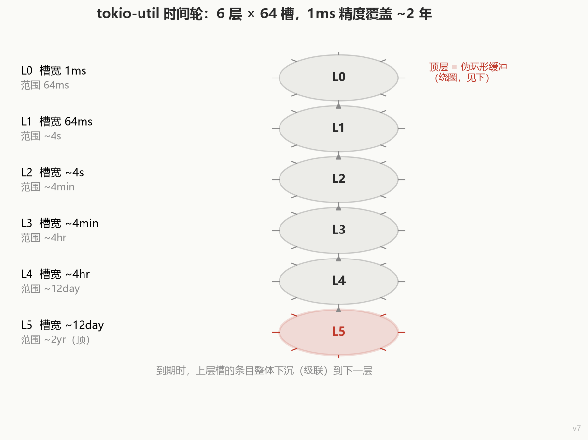
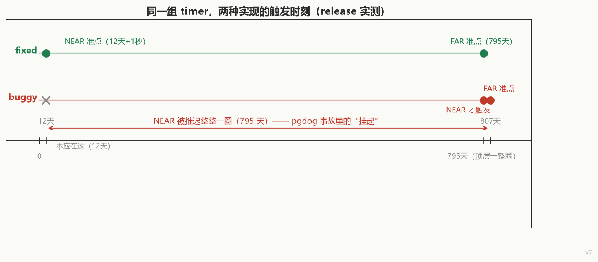
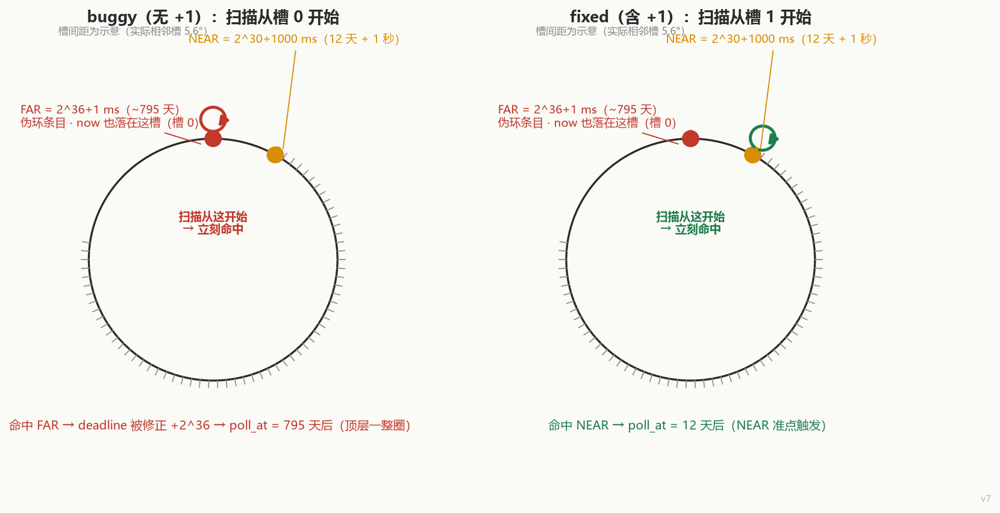

# The `+1` That Wasn't Supposed to Be There

```rust
let now_slot = ((now / slot_range(self.level)) % LEVEL_MULT as u64) as usize + 1;
```

Why does a mature Rust library — tokio-util — need to **add one** out of nowhere, right in the middle of its timing wheel?

That line was merged in September 2026 (a port of [tokio#8334](https://github.com/tokio-rs/tokio/pull/8334)). It fixes a real production incident: **pgdog**, a PostgreSQL proxy, ran for 12 days and then *every* periodic task quietly stopped firing. No error, no panic — just silence.

Let's look at the pictures first, then the punchline.



**Without that `+1`, a timer due in 12 days fires 807 days late.** An extra year and a half of sleep.



Here's the story in reverse: first what the fix actually does, then why the wheel grew this shape in the first place, and finally where it sits in a thirty-year-old paper.

---

## 1. The timing wheel: "who's next?" in O(1)

The core question any timer service answers is one: **which entry expires next?**

The naive answer is a sorted list of pending timers; take the head. Insert, remove, maintain — all O(n). At kernel scale, that doesn't survive contact with reality.

The timing wheel borrows from a clock: **slice time into equal slots, each holding the entries due at that instant.** The hand advances one slot at a time and processes that slot. Insertion and removal are O(1).

But a clock face only covers one turn. To cover longer horizons, the 1987 SOSP paper gave two classic extensions:

1. **Hash into slots** — too many entries per slot? Hash them onto one and keep a list inside;
2. **Hierarchical wheels** — stack wheels of different granularity; the low levels cover the near future, the high levels the far one, and when a high-level slot matures its entries "cascade down".

tokio-util uses the hierarchy: 6 levels × 64 slots:

| Level | Slot width | Covers |
|---|---|---|
| L0 | 1ms | 64ms |
| L1 | 64ms | ~4s |
| L2 | ~4s | ~4min |
| L3 | ~4min | ~4hr |
| L4 | ~4hr | ~12day |
| L5 (top) | ~12day | ~2yr |

1ms precision, about two years of range. Finding the next occupied slot is an `occupied` bitmap + `rotate_right` + `trailing_zeros` — O(1).

All very pleasant. The trouble starts at the **boundary**.

---

## 2. The boundary: where does the farthest timer go?

The hierarchy is finite. A timer scheduled farther out than one full top-level turn has nowhere to go — so tokio does two things:

1. Cap everything at `MAX_DURATION` (one top-level turn, ~2 years); anything beyond is rejected;
2. **Timers that logically belong to a "top+1" level are forced into a top-level slot.**

The code's own comment (`level.rs`) is blunt:

> What this means is that the top level's slots act as a **pseudo-ring buffer**, and we rotate around them indefinitely.

In other words: **the top level's slots become a pseudo ring buffer that wraps forever.** A single slot may hold an entry that is physically there but logically a whole turn away.

This is the **overflow problem** the Lawn paper (2019) spends its whole argument on — "the farthest timer gets squeezed into the top level" in a hierarchical wheel.

Now zoom into the top level. Say `now` (elapsed time) sits in **slot 0**, and slot 0 happens to hold a wrapped entry (due one full turn later):



The "next expiration" scan starts at the slot that `now` occupies and walks clockwise to the first occupied slot.

**Here's the trap: if the scan starts at slot 0 and slot 0 is occupied — by the wrapped entry — it stops immediately.** But that entry is logically a turn away; it must not be treated as "now".

The `+1` does exactly one thing: **shift the scan start one slot past the `now` slot, skipping it.** The `now` slot can only ever hold the farthest possible entry — one whole turn away — so skipping it is what lets the scan see the genuinely closer timer in slot 1.

At lower levels the `+1` is a harmless no-op: `level_for` guarantees no entry ever lands in the `now` slot at a lower level (it's always empty there), so skipping or not makes no difference. **The fix only bites at the top level — which is precisely the only level where this can happen.**

---

## 3. What happens without the `+1` (measured, not hand-waved)

Rather than argue it, I lifted tokio-util's wheel into a standalone crate as two versions — `fixed` (with the `+1`) and `buggy` (without) — byte-identical except for that one line — and ran them. Three scenarios:

### Scenario A: minimal repro

Top-level slot 0 holds a wrapped far entry (`2^36+1` ms); slot 1 holds an entry due in 12 days; `now` sits in slot 0:

```
FAR  = 2^36+1 ms   (~795 days)   → top slot 0 (pseudo-ring, same slot as now)
NEAR = 2^30+1000 ms (12d + 1s)   → top slot 1

BUGGY  poll_at = 2^36 (795 days out)   ← hijacked by the wrapped entry
       fires near @ 2^36+2^30+1000     ← NEAR delayed a full turn: 807 days
FIXED  poll_at = 2^30 (12 days out)
       fires near @ 2^30+1000          ← NEAR on time (12d + 1s)
```

**The buggy wheel delays a 12-day timer to day 807.** The delay is exactly one top-level turn (`2^36` ms ≈ 795 days).

(A small "measured beats written" footnote: the port commit's message claims the delay is "~19 days", but `2^36 − 2^31 ms` is actually 770 days — the numbers above are release-mode measurements.)

### Scenario B: lower-level short timers are immune (control)

Running 12 days, one long sleep occupying the top level, one 5-second interval. Prediction: buggy and fixed behave identically.

They do — because the 5-second interval, measured by relative distance, lands in a lower level (L2) and never enters the top level. The pseudo-ring can't reach it.

This draws the bug's boundary precisely: **the problem lives only at the top level; short timers at lower levels are naturally immune.** Not every timer is affected — only the ones that also happen to sit at the top.

### Scenario B2: pgdog's exact mechanism

So why did pgdog's intervals get caught? The key is that `level_for` uses **`elapsed ^ when` (XOR distance)**, not plain `when − elapsed`.

Setup: `elapsed = 2^30 − 1000` (just under the 12-day boundary), one near-max-duration sleep, one 5-second interval:

```
elapsed   = 2^30 - 1000           (12 days - 1 second)
MAX_TIMER = elapsed + 2^36 - 2000 (top now_slot, the pseudo-ring entry)
INTERVAL  = elapsed + 5000        (straddles the 2^30 boundary!)

  → INTERVAL's elapsed^when ≈ 2^31 (XOR distance explodes)
  → level_for fudges it into the top level, slot 1

BUGGY  poll_at = 2^36 (795 days out)   ← hijacked by the wrapped entry
       fires interval_5s @ day 807     ← a 5-second interval hangs for 795 days
FIXED  poll_at = 2^30 (1 second out)
       fires interval_5s on time
```

**All the trigger conditions are in:** uptime near the 12-day boundary + a long timer occupying the top-level `now` slot + a short timer straddling the `2^30` boundary (XOR distance explodes, `level_for` pushes it to the top). The moment they meet, the short timer gets hijacked and `poll_at` jumps a full turn ahead.

tokio's runtime driver takes `poll_at` **once** before each `park`, then sleeps until that instant with no other wakeup source — so a hijacked `poll_at` means the driver sleeps a full turn, and every short-periodic timer "hangs". That's the incident, exactly.

> One correction to a claim that has been floating around: #8334's PR description says "short sleeps got queued on the top level 5". That's true, but the reason is **not "short" — it's "straddling the boundary, so the XOR distance explodes"**. Scenario B proves it: short timers that don't straddle the boundary sit at lower levels and are untouched.

All three scenarios, plus the nine unit tests ported over, pass; the 12 wheel tests in the local tokio checkout also pass.

---

## 4. A thirty-year lineage

The `+1` didn't appear from nowhere. It sits at the end of this line:

| Year | Paper | Venue | One-liner | Cites* |
|---|---|---|---|---|
| 1987 | Varghese & Lauck, *Hashed and hierarchical timing wheels* | SOSP '87 (DEC) | Foundational: O(1) hashed wheel + hierarchy | 89 (journal ext. +51) |
| 1998 | Costello & Varghese, *Redesigning the BSD timer facilities* | Softw. Pract. Exper. | Timing wheels actually land in the NetBSD kernel | 3 |
| 1999/2000 | Aron & Druschel, *Soft timers* | SOSP '99 / TOCS 2000 | Microsecond-scale software timers for network processing | 103 |
| 2017 | Saeed et al. (Georgia Tech + Google), *Carousel* | SIGCOMM '17 | End-host traffic shaping, million flows | 104 |
| 2019 | Lev-Libfeld, *Lawn* | arXiv | Bucket by TTL, drop the hierarchy, attack overflow | — |
| 2026 | tokio-util wheel | Rust, userspace | 6-level wheel, arbitrary TTL, `+1` for the top-level pseudo-ring | — |

\* Citation counts from OpenAlex, snapshot 2026-09-28.

An easily overlooked fact: **the O(1) data structure was proposed in 1987, but it only reached a kernel in 1998.** Three decades of evolution then ran along three axes:

- **Granularity**: Soft timers push software event scheduling down to tens of microseconds, enabling rate-based TCP pacing;
- **Structural simplification**: Lawn drops the hierarchy entirely and buckets by TTL;
- **Application domain**: Carousel puts it to work in end-host traffic shaping (its references do include the 1987 original — the lineage is confirmed, not guessed).

One wheel, three hosts: **the 1987 data structure, the 1998 kernel's interrupt-lockout constraint, tokio's userspace single thread.** The BSD 1998 constraint — "lock out interrupts only for a small, bounded amount of time" — simply doesn't exist in tokio-util: `DelayQueue` runs in userspace, waiting on a `tokio::time::Sleep` for the next deadline and advancing its own wheel after being woken; there is no hardware-interrupt critical section to bound.

---

## 5. Why Lawn Is a Poor Fit for a General-Purpose DelayQueue

Lawn's core idea: **don't bucket by expiration time, bucket by TTL value.** One queue per TTL, naturally ordered by enqueue time within each queue; every tick, "mow" the expired heads off each bucket.

The payoff is that the overflow problem vanishes structurally — no hierarchy, no "where does the farthest timer go". **The price: average PerTick complexity O(t), where t = the number of distinct TTLs.** The paper's own applicability condition: *distinct TTL count ≪ concurrent timer count*.

Side by side:

| | tokio-util (hierarchical wheel) | Lawn (TTL bucketing) |
|---|---|---|
| Assumption | TTLs are arbitrary (users pass any `sleep(Duration)`) | distinct TTL count ≪ concurrent timer count |
| Boundary handling | top-level pseudo-ring + `+1` offset + `MAX_DURATION` cap | no overflow (structurally absent) |
| Cost | boundary logic is subtle, error-prone (this incident) | PerTick O(t), t = distinct TTL count |
| Fit | general-purpose userspace runtimes | TTL-concentrated scenarios like Redis streams / RDMA |

**Lawn's core precondition does not naturally match a general-purpose `DelayQueue` with arbitrary deadlines**: tokio's TTLs are arbitrary user values, and the number of distinct TTLs can easily be on the same order as the concurrent timer count, at which point the O(t) per-tick cost stops being affordable. This mismatch helps explain why a hierarchical wheel is the **more natural, requirement-compatible** choice here — it pays a one-line `+1` to sidestep Lawn's O(t) precondition risk.

Conversely, forcing a hierarchical wheel onto a TTL-concentrated workload like Redis streams would be a sledgehammer for a nail.

Two data structures, two preconditions, each covering its own ground. This is not "one is more advanced", and it is not "tokio looked at Lawn and rejected it" — engineering design rarely lets a single set of conditions prove a choice "uniquely correct". You can only say **which precondition lines up with the requirement at hand**.

---

## 6. Open questions

1. **GD-Wheel (EuroSys '15)**: OpenAlex attaches an abstract about Memcached/Redis cache replacement to this record — unrelated to timing wheels; the ACM page 403s, unverifiable. **Not included in the core lineage** — either the metadata is misattached, or my assumption about it is wrong.
2. **Full texts of 1987 and Soft timers**: behind the ACM paywall (Cloudflare challenge + mirror 401); this article's claims about them stop at the abstract.
3. **Carousel's pacing internals**: verified only that it cites the 1987 original; "pacing uses a timing wheel" is not verified against the full text and is not claimed.

---

## Footnotes

① Two earlier misattributions were corrected during writing: the 1987 authors (once mis-remembered as Andersson & Erlick; actually Varghese & Lauck) and "moved into an OS" (once attributed to 1987; actually 1998). Mis-remembering authorship and years is the norm in literature work; re-verifying every claim before writing is the discipline that catches it.

② Method note: discovery, metadata, citation networks and abstracts via the OpenAlex REST API (no key); reference lists via Crossref (by DOI); citation-graph visualization via Semantic Scholar web pages; **code behavior via a standalone two-version crate** (fixed/buggy byte-identical except the `+1`, run in release mode). Every "paper claims X" is tagged with its evidence level; every code claim carries a line number or a measured output.

③ Code quoted from `tokio-util/src/time/wheel/` (MIT license; line numbers refer to the local checkout at time of writing).
